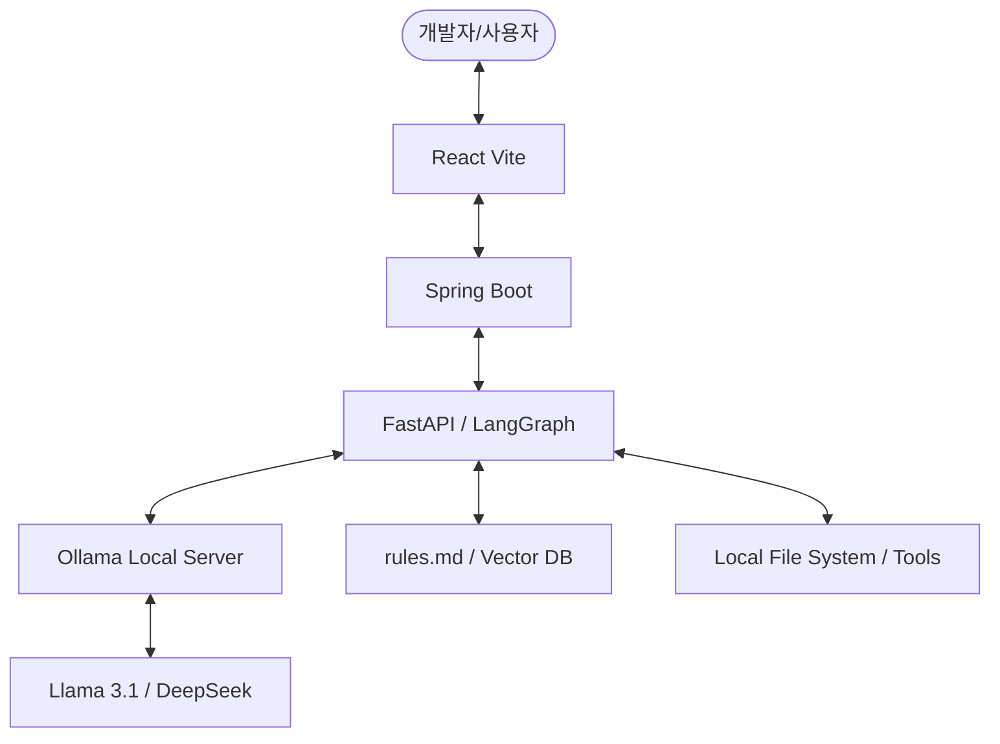

# [분석 보고서] Ollama 기반 로컬 AI 시스템 구축 타당성 검토

## 1. 개요
본 보고서는 API 비용 발생 없이 맥북(Apple Silicon) 로컬 환경에서 Ollama를 활용하여 **지능형 온보딩 및 개발 자동화 플랫폼(IOAP)**을 구현하는 것이 가능한지 분석합니다.

## 2. 결론: "충분히 가능하며, 오히려 권장됨"
맥북 터미널에서 Ollama를 돌리면서 AI 기능을 구현하는 것은 매우 **현실적이고 효과적인 전략**입니다. 특히 Apple Silicon(M1, M2, M3) 칩셋의 통합 메모리 구조는 로컬 LLM 실행에 있어 전용 GPU 못지않은 성능을 보여줍니다.

---

## 3. 상세 분석

### 💰 비용 측면 (API vs Local)
| 항목 | OpenAI / Claude API | Ollama (Local) |
| :--- | :--- | :--- |
| **비용** | 사용량에 따른 과금 (Token당 발생) | **0원 (전기세 및 하드웨어 점유만 발생)** |
| **데이터 보안** | 외부 서버 전송 필요 | **로컬 내에서만 처리 (기밀 유지 최적)** |
| **인터넷 연결** | 필수 | 오프라인에서도 작동 가능 |

### 🚀 맥북 성능 및 모델 추천
맥북의 통합 메모리(RAM) 용량에 따라 추천하는 모델입니다.
- **8GB RAM**: `Llama 3.1 8B (4-bit)`, `Phi-3-mini (3.8B)` - 기본적인 RAG 가능.
- **16GB RAM 이상**: `DeepSeek-Coder-V2-Lite`, `Llama 3.1 8B` - 코드 생성 및 복잡한 추론 가능.
- **32GB RAM 이상**: `Codestral`, `Llama 3.1 70B (양자화 모델)` - 최상위 성능의 에이전트 구축 가능.

### 🧩 핵심 기능 구현 방안
1. **LangGraph 연동**:
    - Ollama는 OpenAI 호환 API 서버를 지원합니다 (`localhost:11434/v1`).
    - Python 기반의 LangGraph 프레임워크에서 모델 엔드포인트만 로컬로 변경하면 즉시 연동됩니다.
2. **RAG (rules.md 학습)**:
    - `nomic-embed-text`와 같은 로컬 임베딩 모델을 Ollama로 구동하여 벡터 DB를 로컬에 구축할 수 있습니다.
3. **MCP (Model Context Protocol)**:
    - MCP 서버를 로컬에서 실행하고, Ollama 기반 에이전트에게 도구(Tool) 권한을 부여하여 로컬 파일 및 DB를 제어하게 할 수 있습니다.

---

## 4. 향후 시스템 아키텍처 (제안)

## 5. 단계별 실행 계획
1. **1단계**: Ollama 설치 및 `Llama 3.1` 혹은 `DeepSeek-Coder` 모델 다운로드.
2. **2단계**: LangChain 또는 LangGraph의 `ChatOllama` 인터페이스를 사용하여 API 연동 확인.
3. **3단계**: `/rules` 폴더의 문서를 임베딩하여 로컬 RAG 시스템 구축.
4. **4단계**: MCP를 연결하여 AI가 직접 프로젝트 파일을 읽고 쓸 수 있도록 권한 부여.

---

> [!IMPORTANT] 
> **"마자요!"** 올라마로 충분히 구상하시는 시스템을 구현할 수 있습니다. 특히 맥북은 로컬 LLM을 돌리기에 최고의 환경 중 하나입니다. 지금 바로 시작하셔도 무방합니다.
