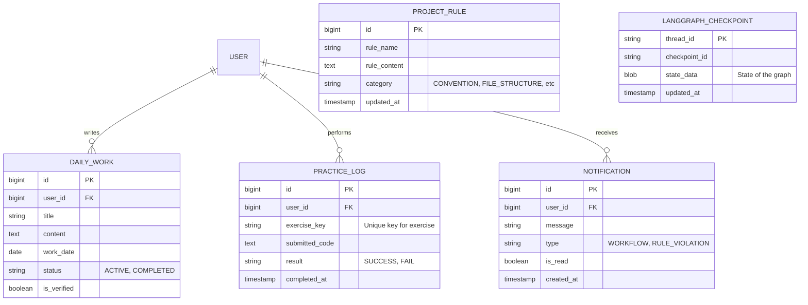

# [상세 설계] 데이터베이스 모델링 (Database Modeling)

## 1. 개요
지능형 온보딩 플랫폼의 핵심 데이터(사용자, 업무, 실습 기록, 랭그래프 상태 등)를 관리하기 위한 데이터베이스 구조를 정의합니다.

---

## 2. ER 다이어그램 (Mermaid)

---

## 3. 주요 테이블 상세 설명

### 3.1 `USER` 및 `DAILY_WORK`
- **목적**: 신입 사원의 일일 목표와 작업 내용을 저장합니다.
- **특이사항**: `is_verified` 컬럼을 통해 AI 에이전트가 해당 업무가 팀 룰에 맞게 처리되었는지 검증했는지 여부를 표시합니다.

### 3.2 `PROJECT_RULE`
- **목적**: `rules.md` 파일에서 추출된 규칙들을 검색 및 에이전트 참조가 용이하도록 DB화합니다.

### 3.3 `LANGGRAPH_CHECKPOINT`
- **목적**: 랭그래프의 '상태 보존(Memory)' 기능을 위해 대화의 맥락(State)을 영속화합니다. (Postgres 기반의 Checkpointer 사용 권장)

### 3.4 `PRACTICE_LOG`
- **목적**: 자바 실습 문제의 풀이 이력과 성공 여부를 기록합니다.
