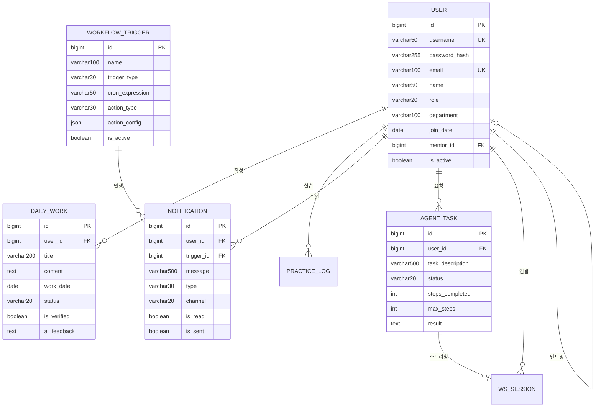

# [상세 설계] 데이터베이스 모델링 (Database Modeling) v2.0

## 1. 개요
지능형 온보딩 플랫폼의 핵심 데이터를 관리하기 위한 데이터베이스 구조입니다.
**v2.0**에서는 자율 에이전트, 워크플로우 트리거, WebSocket 세션 관리를 추가합니다.

---

## 2. 테이블 상세 명세

### 2.1 USER (사용자)

| 컬럼명 | 타입 | 제약조건 | 코멘트 |
|:---|:---|:---|:---|
| `id` | BIGINT | PK, AUTO_INCREMENT | 사용자 고유 ID |
| `username` | VARCHAR(50) | UK, NOT NULL | 로그인 아이디 |
| `password_hash` | VARCHAR(255) | NOT NULL | BCrypt 암호화된 비밀번호 |
| `email` | VARCHAR(100) | UK, NOT NULL | 이메일 주소 |
| `name` | VARCHAR(50) | NOT NULL | 실명 |
| `role` | VARCHAR(20) | NOT NULL, DEFAULT 'USER' | 역할 (MANAGER/USER) |
| `department` | VARCHAR(100) | NULL | 소속 부서 |
| `join_date` | DATE | NULL | 입사일 |
| `mentor_id` | BIGINT | FK(USER.id), NULL | 멘토 사용자 ID (시니어 지정) |
| `is_active` | BOOLEAN | NOT NULL, DEFAULT TRUE | 활성화 여부 |
| `created_at` | TIMESTAMP | NOT NULL, DEFAULT NOW() | 계정 생성일시 |
| `updated_at` | TIMESTAMP | NOT NULL, DEFAULT NOW() | 마지막 수정일시 |

---

### 2.2 DAILY_WORK (일일 업무 기록)

| 컬럼명 | 타입 | 제약조건 | 코멘트 |
|:---|:---|:---|:---|
| `id` | BIGINT | PK, AUTO_INCREMENT | 업무 기록 ID |
| `user_id` | BIGINT | FK(USER.id), NOT NULL | 작성자 ID |
| `title` | VARCHAR(200) | NOT NULL | 업무 제목 |
| `content` | TEXT | NULL | 업무 상세 내용 (최대 65,535자) |
| `work_date` | DATE | NOT NULL | 업무 수행일 |
| `status` | VARCHAR(20) | NOT NULL, DEFAULT 'PENDING' | 상태 (PENDING/IN_PROGRESS/COMPLETED) |
| `is_verified` | BOOLEAN | NOT NULL, DEFAULT FALSE | AI 검증 완료 여부 |
| `ai_feedback` | TEXT | NULL | AI 에이전트 회고 피드백 |
| `created_at` | TIMESTAMP | NOT NULL, DEFAULT NOW() | 생성일시 |
| `updated_at` | TIMESTAMP | NOT NULL, DEFAULT NOW() | 수정일시 |

---

### 2.3 PRACTICE_LOG (실습 기록)

| 컬럼명 | 타입 | 제약조건 | 코멘트 |
|:---|:---|:---|:---|
| `id` | BIGINT | PK, AUTO_INCREMENT | 실습 기록 ID |
| `user_id` | BIGINT | FK(USER.id), NOT NULL | 실습자 ID |
| `exercise_key` | VARCHAR(100) | NOT NULL | 실습 문제 고유 키 |
| `submitted_code` | TEXT | NOT NULL | 제출한 코드 (최대 65,535자) |
| `result` | VARCHAR(20) | NOT NULL | 결과 (SUCCESS/FAIL) |
| `ai_review` | TEXT | NULL | AI 코드 리뷰 결과 |
| `completed_at` | TIMESTAMP | NOT NULL, DEFAULT NOW() | 완료일시 |

---

### 2.4 PROJECT_RULE (프로젝트 규칙)

| 컬럼명 | 타입 | 제약조건 | 코멘트 |
|:---|:---|:---|:---|
| `id` | BIGINT | PK, AUTO_INCREMENT | 규칙 ID |
| `rule_name` | VARCHAR(100) | NOT NULL | 규칙 이름 |
| `rule_content` | TEXT | NOT NULL | 규칙 상세 내용 |
| `category` | VARCHAR(50) | NOT NULL | 카테고리 (CONVENTION/API/FILE_STRUCTURE) |
| `embedding` | VECTOR(1536) | NULL | RAG용 벡터 임베딩 (Ollama nomic-embed-text) |
| `updated_at` | TIMESTAMP | NOT NULL, DEFAULT NOW() | 마지막 수정일시 |

---

### 2.5 AGENT_TASK (자율 에이전트 태스크)

| 컬럼명 | 타입 | 제약조건 | 코멘트 |
|:---|:---|:---|:---|
| `id` | BIGINT | PK, AUTO_INCREMENT | 태스크 ID |
| `user_id` | BIGINT | FK(USER.id), NOT NULL | 요청자 ID |
| `task_description` | VARCHAR(500) | NOT NULL | 태스크 설명 |
| `status` | VARCHAR(20) | NOT NULL, DEFAULT 'PENDING' | 상태 (PENDING/RUNNING/COMPLETED/FAILED) |
| `steps_completed` | INT | NOT NULL, DEFAULT 0 | 완료된 단계 수 |
| `max_steps` | INT | NOT NULL, DEFAULT 10 | 최대 실행 단계 수 |
| `result` | TEXT | NULL | 실행 결과 |
| `error_message` | VARCHAR(1000) | NULL | 에러 발생 시 메시지 |
| `started_at` | TIMESTAMP | NULL | 실행 시작일시 |
| `completed_at` | TIMESTAMP | NULL | 완료일시 |

---

### 2.6 WORKFLOW_TRIGGER (워크플로우 트리거)

| 컬럼명 | 타입 | 제약조건 | 코멘트 |
|:---|:---|:---|:---|
| `id` | BIGINT | PK, AUTO_INCREMENT | 트리거 ID |
| `name` | VARCHAR(100) | NOT NULL | 워크플로우 이름 |
| `trigger_type` | VARCHAR(30) | NOT NULL | 트리거 유형 (SCHEDULE/FILE_CHANGE/MANUAL) |
| `cron_expression` | VARCHAR(50) | NULL | 스케줄 표현식 (예: 0 0 18 * * ?) |
| `action_type` | VARCHAR(30) | NOT NULL | 액션 유형 (SLACK/EMAIL/WEBHOOK) |
| `action_config` | JSON | NOT NULL | 액션 설정 (webhook URL, 수신자 등) |
| `is_active` | BOOLEAN | NOT NULL, DEFAULT TRUE | 활성화 여부 |
| `last_executed_at` | TIMESTAMP | NULL | 마지막 실행일시 |
| `created_at` | TIMESTAMP | NOT NULL, DEFAULT NOW() | 생성일시 |

---

### 2.7 WS_SESSION (WebSocket 세션)

| 컬럼명 | 타입 | 제약조건 | 코멘트 |
|:---|:---|:---|:---|
| `session_id` | VARCHAR(100) | PK | WebSocket 세션 ID |
| `user_id` | BIGINT | FK(USER.id), NOT NULL | 연결된 사용자 ID |
| `connection_status` | VARCHAR(20) | NOT NULL | 상태 (CONNECTED/DISCONNECTED) |
| `current_task_id` | BIGINT | FK(AGENT_TASK.id), NULL | 현재 스트리밍 중인 태스크 |
| `connected_at` | TIMESTAMP | NOT NULL | 연결 시작일시 |
| `last_heartbeat` | TIMESTAMP | NOT NULL | 마지막 하트비트 시간 |

---

### 2.8 NOTIFICATION (알림)

| 컬럼명 | 타입 | 제약조건 | 코멘트 |
|:---|:---|:---|:---|
| `id` | BIGINT | PK, AUTO_INCREMENT | 알림 ID |
| `user_id` | BIGINT | FK(USER.id), NOT NULL | 수신자 ID |
| `trigger_id` | BIGINT | FK(WORKFLOW_TRIGGER.id), NULL | 트리거 ID (워크플로우 발생 시) |
| `message` | VARCHAR(500) | NOT NULL | 알림 메시지 |
| `type` | VARCHAR(30) | NOT NULL | 유형 (WORKFLOW/RULE_VIOLATION/AGENT/REMINDER) |
| `channel` | VARCHAR(20) | NOT NULL, DEFAULT 'WEB' | 채널 (WEB/SLACK/EMAIL) |
| `is_read` | BOOLEAN | NOT NULL, DEFAULT FALSE | 읽음 여부 |
| `is_sent` | BOOLEAN | NOT NULL, DEFAULT FALSE | 발송 완료 여부 (외부 채널) |
| `created_at` | TIMESTAMP | NOT NULL, DEFAULT NOW() | 생성일시 |

---

### 2.9 LANGGRAPH_CHECKPOINT (LangGraph 체크포인트)

| 컬럼명 | 타입 | 제약조건 | 코멘트 |
|:---|:---|:---|:---|
| `thread_id` | VARCHAR(100) | PK | 대화 스레드 ID |
| `checkpoint_id` | VARCHAR(100) | NOT NULL | 체크포인트 ID |
| `state_data` | BYTEA | NOT NULL | 직렬화된 그래프 상태 데이터 |
| `updated_at` | TIMESTAMP | NOT NULL, DEFAULT NOW() | 마지막 업데이트 시간 |

---

## 3. ER 다이어그램

---

## 4. 인덱스 전략

| 테이블 | 인덱스명 | 컬럼 | 용도 |
|:---|:---|:---|:---|
| USER | `idx_user_role` | `(role, is_active)` | 역할별 활성 사용자 조회 |
| USER | `idx_user_mentor` | `(mentor_id)` | 멘토별 멘티 조회 |
| DAILY_WORK | `idx_work_user_date` | `(user_id, work_date)` | 사용자별 날짜 조회 |
| AGENT_TASK | `idx_task_user_status` | `(user_id, status)` | 사용자별 진행 중 태스크 |
| WORKFLOW_TRIGGER | `idx_trigger_active` | `(is_active, trigger_type)` | 활성 스케줄러 조회 |
| NOTIFICATION | `idx_notif_user_unread` | `(user_id, is_read)` | 미읽은 알림 조회 |
| WS_SESSION | `idx_ws_user` | `(user_id)` | 사용자 세션 조회 |

---

## 5. 제약조건 요약

| 타입 | 최대 길이 | 용도 예시 |
|:---|:---|:---|
| VARCHAR(20) | 20자 | 상태값, 역할, 채널 |
| VARCHAR(30) | 30자 | 액션 타입, 트리거 타입 |
| VARCHAR(50) | 50자 | 이름, 아이디, cron 표현식 |
| VARCHAR(100) | 100자 | 이메일, 부서, 세션 ID |
| VARCHAR(200) | 200자 | 제목 |
| VARCHAR(500) | 500자 | 태스크 설명, 알림 메시지 |
| VARCHAR(1000) | 1000자 | 에러 메시지 |
| TEXT | ~65KB | 본문, 코드, 피드백 |
| JSON | 가변 | 설정 데이터 |
