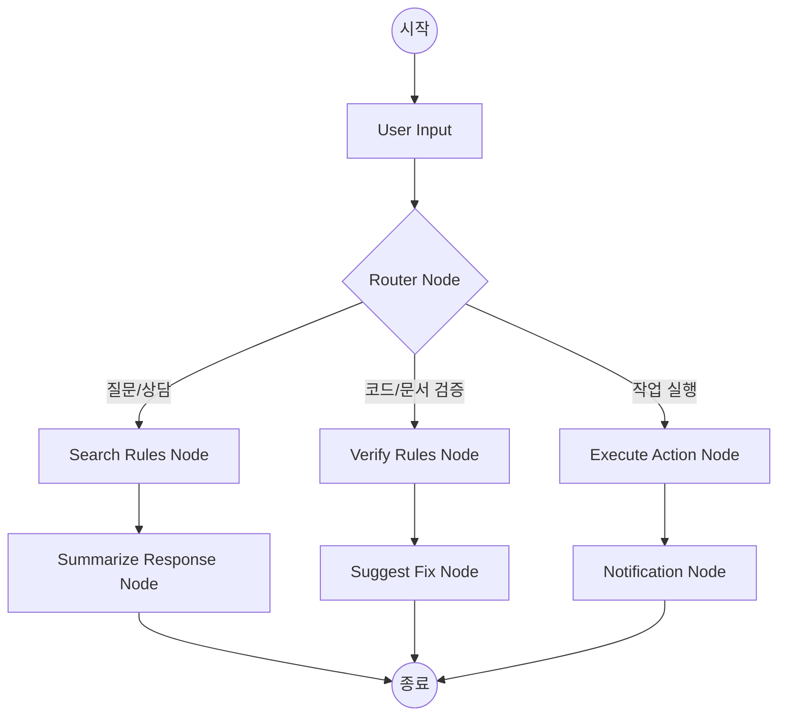

# [상세 설계] LangGraph 노드 상세 설계

## 1. 랭그래프 구조도 (Logical Flow)

---

## 2. 노드별 상세 정의

### 2.1 Router Node (의도 파악)
- **역할**: LLM을 통해 사용자 입력이 질문인지, 검증 요청인지, 실행 명령인지 판별.
- **출력**: `next_node` (RAG, Verify, Action 중 하나).

### 2.2 Search Rules Node (RAG)
- **역할**: 벡터 DB 또는 DB의 `PROJECT_RULE` 테이블에서 관련 규칙 검색.
- **컨텍스트**: 검색된 룰을 그래프 상태(`state`)에 저장.

### 2.3 Verify Rules Node (검증)
- **역할**: 입력된 내용이 검색된 룰에 부합하는지 논리적으로 비교.
- **로직**: `match: true/false`, `reasons: []` 반환.

### 2.4 Execute Action Node (수행)
- **역할**: MCP 도구를 호출하여 실제로 파일을 생성하거나 데이터를 업데이트.

---

## 3. 그래프 상태 (State) 정의
- `message_history`: 대화 이력 (Memory 연동).
- `current_task`: 현재 수행 중인 작업 정보.
- `retrieved_rules`: 검색된 프로젝트 룰 리스트.
- `validation_result`: 룰 검증 결과 데이터.
