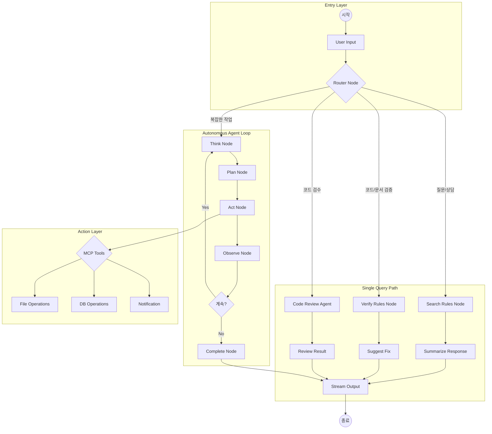

# [상세 설계] LangGraph 노드 상세 설계 v2.0

## 1. 개요

LangGraph 기반의 지능형 에이전트 구조입니다. **v2.0**에서는 자율 에이전트 루프(Autonomous Loop), LLM 모드 스위칭(API/Ollama), **코드 검수 에이전트**를 추가합니다.

> [!TIP] LLM 모드 스위칭
> - 초기: OpenAI/Anthropic API 사용
> - 안정화 후: Ollama 로컬 모드 전환

---

## 2. 전체 그래프 구조



---

## 3. 노드별 상세 정의

### 3.1 Router Node (의도 파악)

```python
def router_node(state: AgentState) -> AgentState:
    """사용자 입력의 의도를 파악하여 다음 노드 결정"""
    prompt = f"""
    사용자 입력: {state.message}
    
    다음 중 하나를 선택하세요:
    - SEARCH: 단순 질문/규칙 검색
    - VERIFY: 코드/문서 검증 요청
    - CODE_REVIEW: 코드 검수 요청 (스타일, 버그, 성능)
    - AUTONOMOUS: 복잡한 작업 (파일 생성, 다단계 분석 등)
    """
    
    response = llm_client.chat(messages=[...])
    state.next_node = parse_intent(response)
    return state
```

| 입력 | 라우팅 결과 |
|:---|:---|
| "API 규칙 알려줘" | SEARCH → RAG |
| "이 코드 스타일 맞아?" | VERIFY → Verify Rules |
| "이 코드 리뷰해줘" | CODE_REVIEW → Code Review Agent |
| "Controller 만들어줘" | AUTONOMOUS → Think |

### 3.2 Search Rules Node (RAG)

```python
def search_rules_node(state: AgentState) -> AgentState:
    """PROJECT_RULE 테이블에서 관련 규칙 검색"""
    # 1. 쿼리 임베딩 생성 (Ollama)
    embedding = ollama.embeddings(model="nomic-embed-text", prompt=state.message)
    
    # 2. 벡터 유사도 검색
    rules = db.search_similar_rules(embedding, top_k=3)
    
    state.retrieved_rules = rules
    return state
```

### 3.3 Verify Rules Node (검증)

```python
def verify_rules_node(state: AgentState) -> AgentState:
    """입력된 코드/문서가 규칙에 부합하는지 검증"""
    prompt = f"""
    [규칙]
    {state.retrieved_rules}
    
    [검증 대상]
    {state.user_code}
    
    위 규칙에 맞는지 검증하고, 위반 사항을 리스트로 반환하세요.
    """
    
    response = llm_client.chat(messages=[...])
    state.validation_result = parse_validation(response)
    return state
```

### 3.4 Code Review Agent (코드 검수) 🆕

```python
def code_review_node(state: AgentState) -> AgentState:
    """코드 검수 에이전트 - 스타일, 버그, 성능, 보안 검토"""
    
    # 1. 프로젝트 규칙 로드
    rules = db.get_all_rules(category="CONVENTION")
    
    prompt = f"""
    당신은 시니어 개발자입니다. 아래 코드를 검수해주세요.
    
    [프로젝트 코딩 컨벤션]
    {rules}
    
    [검수 대상 코드]
    ```
    {state.user_code}
    ```
    
    다음 항목을 검토하고 JSON 형식으로 결과를 반환하세요:
    
    1. **스타일 (style)**: 코딩 컨벤션 준수 여부
    2. **버그 (bugs)**: 잠재적 버그 및 에러 가능성
    3. **성능 (performance)**: 성능 개선 포인트
    4. **보안 (security)**: 보안 취약점
    5. **가독성 (readability)**: 코드 가독성 및 구조
    6. **총평 (summary)**: 전체 평가 및 점수 (1-10)
    
    각 항목별로 발견된 이슈와 개선 제안을 포함해주세요.
    """
    
    response = llm_client.chat(messages=[
        {"role": "system", "content": "You are a senior code reviewer."},
        {"role": "user", "content": prompt}
    ])
    
    state.code_review_result = parse_review_result(response)
    return state

def parse_review_result(response) -> dict:
    """리뷰 결과 파싱"""
    return {
        "style": [],      # 스타일 이슈 리스트
        "bugs": [],       # 버그 리스트
        "performance": [],# 성능 이슈 리스트
        "security": [],   # 보안 이슈 리스트
        "readability": [],# 가독성 이슈 리스트
        "summary": "",    # 총평
        "score": 0        # 점수 (1-10)
    }
```

**코드 검수 결과 예시:**
```json
{
  "style": [
    {"line": 15, "issue": "@RequestMapping 대신 @GetMapping 사용 권장", "severity": "warning"}
  ],
  "bugs": [
    {"line": 23, "issue": "NullPointerException 가능성", "severity": "error"}
  ],
  "performance": [
    {"line": 30, "issue": "N+1 쿼리 문제 발생 가능", "severity": "warning"}
  ],
  "security": [],
  "readability": [
    {"line": 10, "issue": "메서드명이 불명확함", "severity": "info"}
  ],
  "summary": "전체적으로 양호하나 NPE 방어 코드 필요",
  "score": 7
}
```

---

## 4. 자율 에이전트 루프 (Autonomous Loop)

### 4.1 Think Node

```python
def think_node(state: AgentState) -> AgentState:
    """현재 상태를 분석하고 다음 행동 계획"""
    prompt = f"""
    [태스크] {state.task_description}
    [완료된 단계] {state.completed_steps}
    [현재 관찰] {state.last_observation}
    
    다음에 무엇을 해야 하는지 생각하세요.
    """
    
    response = ollama.chat(model="llama3", messages=[...])
    state.current_thought = response
    return state
```

### 4.2 Plan Node

```python
def plan_node(state: AgentState) -> AgentState:
    """구체적인 실행 계획 수립"""
    prompt = f"""
    [생각] {state.current_thought}
    
    사용 가능한 도구:
    - create_file(path, content): 파일 생성
    - read_file(path): 파일 읽기
    - search_rules(query): 규칙 검색
    - execute_code(code): 코드 실행
    
    다음 행동을 JSON 형식으로 계획하세요.
    """
    
    response = ollama.chat(model="llama3", messages=[...])
    state.action_plan = parse_action(response)
    return state
```

### 4.3 Act Node

```python
def act_node(state: AgentState) -> AgentState:
    """계획된 행동 실행 (MCP Tools 호출)"""
    action = state.action_plan
    
    if action.tool == "create_file":
        result = mcp_tools.create_file(action.path, action.content)
    elif action.tool == "read_file":
        result = mcp_tools.read_file(action.path)
    elif action.tool == "search_rules":
        result = search_rules_node(state)
    
    state.action_result = result
    return state
```

### 4.4 Observe Node

```python
def observe_node(state: AgentState) -> AgentState:
    """행동 결과 관찰 및 상태 업데이트"""
    state.last_observation = state.action_result
    state.steps_completed += 1
    state.completed_steps.append({
        "thought": state.current_thought,
        "action": state.action_plan,
        "result": state.action_result
    })
    return state
```

### 4.5 Should Continue (조건부 엣지)

```python
def should_continue(state: AgentState) -> str:
    """루프 계속 여부 판단"""
    # 최대 단계 도달
    if state.steps_completed >= state.max_steps:
        return "complete"
    
    # 태스크 완료 판단
    if "TASK_COMPLETE" in state.last_observation:
        return "complete"
    
    # 에러 발생
    if state.error:
        return "complete"
    
    return "continue"
```

---

## 5. 그래프 상태 (State) 정의

```python
from typing import TypedDict, List, Optional

class AgentState(TypedDict):
    # 기본 정보
    thread_id: str
    user_id: int
    message: str
    
    # 라우팅
    next_node: str
    
    # RAG 관련
    retrieved_rules: List[dict]
    
    # 검증 관련
    user_code: Optional[str]
    validation_result: Optional[dict]
    
    # 자율 에이전트 관련
    task_description: str
    max_steps: int
    steps_completed: int
    completed_steps: List[dict]
    current_thought: str
    action_plan: dict
    action_result: str
    last_observation: str
    error: Optional[str]
    
    # 출력
    final_response: str
    stream_tokens: List[str]
```

---

## 6. Ollama 네이티브 연동

```python
import os
from abc import ABC, abstractmethod

class LLMClient(ABC):
    """LLM 클라이언트 추상 클래스"""
    @abstractmethod
    def chat(self, messages: list, stream: bool = False): pass
    
    @abstractmethod
    def chat_stream(self, messages: list): pass
    
    @abstractmethod
    def embed(self, text: str) -> list: pass

class APIClient(LLMClient):
    """OpenAI/Anthropic API 클라이언트 (초기 개발용)"""
    def __init__(self, provider: str = "openai"):
        if provider == "openai":
            from openai import OpenAI
            self.client = OpenAI()
            self.model = "gpt-4o-mini"
        else:
            from anthropic import Anthropic
            self.client = Anthropic()
            self.model = "claude-3-haiku-20240307"
        self.provider = provider
    
    def chat(self, messages: list, stream: bool = False):
        if self.provider == "openai":
            return self.client.chat.completions.create(
                model=self.model, messages=messages, stream=stream
            )
        else:
            return self.client.messages.create(
                model=self.model, messages=messages, stream=stream
            )
    
    def chat_stream(self, messages: list):
        response = self.chat(messages, stream=True)
        for chunk in response:
            if self.provider == "openai":
                yield chunk.choices[0].delta.content or ""
            else:
                yield chunk.delta.text or ""
    
    def embed(self, text: str) -> list:
        response = self.client.embeddings.create(
            model="text-embedding-3-small", input=text
        )
        return response.data[0].embedding

class OllamaClient(LLMClient):
    """Ollama 로컬 클라이언트 (안정화 후 전환)"""
    def __init__(self, model: str = "llama3"):
        import ollama
        self.ollama = ollama
        self.model = model
    
    def chat(self, messages: list, stream: bool = False):
        return self.ollama.chat(
            model=self.model, messages=messages, stream=stream
        )
    
    def chat_stream(self, messages: list):
        for chunk in self.ollama.chat(
            model=self.model, messages=messages, stream=True
        ):
            yield chunk["message"]["content"]
    
    def embed(self, text: str) -> list:
        return self.ollama.embeddings(
            model="nomic-embed-text", prompt=text
        )["embedding"]

def get_llm_client() -> LLMClient:
    """환경 변수에 따라 적절한 LLM 클라이언트 반환"""
    mode = os.getenv("LLM_MODE", "api")  # 기본값: API 모드
    provider = os.getenv("LLM_PROVIDER", "openai")
    
    if mode == "local":
        return OllamaClient(model=os.getenv("OLLAMA_MODEL", "llama3"))
    else:
        return APIClient(provider=provider)

# 사용 예시
llm_client = get_llm_client()
```

---

## 7. Git Worktree 병렬 에이전트

```python
import subprocess
from pathlib import Path

class ParallelAgentManager:
    def __init__(self, base_repo: Path):
        self.base_repo = base_repo
        self.workers = []
    
    def create_worker(self, worker_id: str) -> Path:
        """새 Worktree 생성"""
        worker_path = self.base_repo.parent / f"agent-worker-{worker_id}"
        subprocess.run([
            "git", "worktree", "add", str(worker_path), "main"
        ], cwd=self.base_repo)
        return worker_path
    
    def run_parallel_tasks(self, tasks: list):
        """여러 태스크를 병렬 실행"""
        import asyncio
        
        async def run_task(task, worker_path):
            agent = AutonomousAgent(working_dir=worker_path)
            return await agent.run(task)
        
        loop = asyncio.get_event_loop()
        results = loop.run_until_complete(
            asyncio.gather(*[
                run_task(task, self.create_worker(f"task-{i}"))
                for i, task in enumerate(tasks)
            ])
        )
        return results
    
    def cleanup_workers(self):
        """Worktree 정리"""
        for worker in self.workers:
            subprocess.run(["git", "worktree", "remove", str(worker)])
```

---

## 8. 그래프 컴파일 및 실행

```python
from langgraph.graph import StateGraph, END

def build_agent_graph() -> StateGraph:
    graph = StateGraph(AgentState)
    
    # 노드 추가
    graph.add_node("router", router_node)
    graph.add_node("search_rules", search_rules_node)
    graph.add_node("verify_rules", verify_rules_node)
    graph.add_node("summarize", summarize_node)
    graph.add_node("suggest_fix", suggest_fix_node)
    graph.add_node("think", think_node)
    graph.add_node("plan", plan_node)
    graph.add_node("act", act_node)
    graph.add_node("observe", observe_node)
    graph.add_node("complete", complete_node)
    graph.add_node("stream_output", stream_output_node)
    
    # 엣지 연결
    graph.set_entry_point("router")
    
    graph.add_conditional_edges("router", route_by_intent, {
        "SEARCH": "search_rules",
        "VERIFY": "verify_rules",
        "AUTONOMOUS": "think"
    })
    
    graph.add_edge("search_rules", "summarize")
    graph.add_edge("verify_rules", "suggest_fix")
    graph.add_edge("summarize", "stream_output")
    graph.add_edge("suggest_fix", "stream_output")
    
    # 자율 루프
    graph.add_edge("think", "plan")
    graph.add_edge("plan", "act")
    graph.add_edge("act", "observe")
    graph.add_conditional_edges("observe", should_continue, {
        "continue": "think",
        "complete": "complete"
    })
    graph.add_edge("complete", "stream_output")
    
    graph.add_edge("stream_output", END)
    
    return graph.compile()
```
