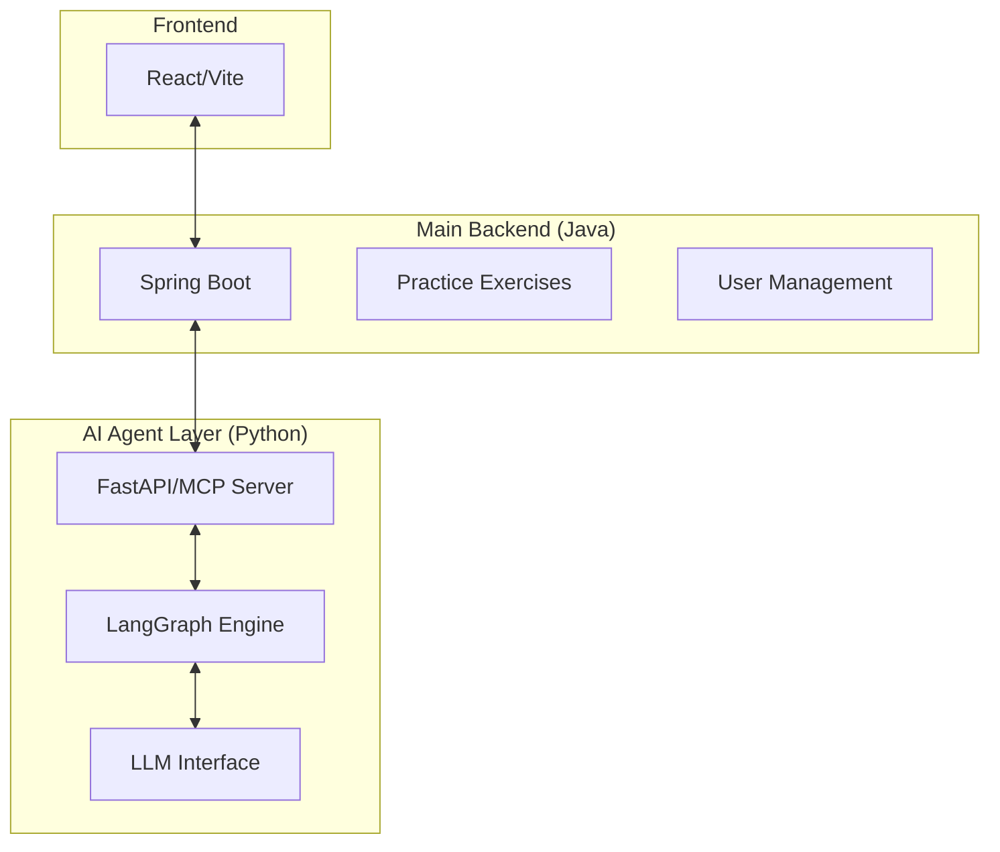

# [기술 제안] Hybrid AI Onboarding Architecture

## 1. 개요 (Overview)
본 문서는 신무 Java 환경과 최신 AI 생태계(LangGraph)를 효율적으로 통합하기 위한 기술 아키텍처 제안서입니다.

---

## 2. 하이브리드 구성안
- **Main Backend (Java Spring Boot)**: 실무와 동일한 개발 환경 제공, 사용자 관리 및 실습 엔진 담당.
- **AI Agent Layer (Python MCP Server)**: LangGraph 기반의 복잡한 추론 및 의사결정 담당.

### 🏛️ 시스템 구조 (Diagram)

---

## 3. 기술 선택 근거 (Justification)

### 🚩 오버 엔지니어링 방지
1. **분리하지만 가볍게**: Python 서비스를 거대한 백엔드로 만드는 것이 아니라, 오직 **에이전트 로직(LangGraph)**만 담당하는 '사이드카(Sidecar)' 서비스로 운영하여 시스템 복잡도를 최소화합니다.
2. **표준화된 통신**: Java와 Python 사이의 복잡한 커스텀 통신 대신, 표준화된 **MCP 프로토콜**을 사용하여 인터페이스를 단순화합니다.

### 🚩 실무 적합성
1. **현업 Java 환경 유지**: 신입 사원들이 입사 후 적응해야 할 Java 환경을 메인 백엔드로 유지하여 실습의 실효성을 높입니다.
2. **AI 생태계 활용**: 랭그래프의 강력한 기능을 위해 Python 핵심 로직을 분리함으로써, Java로 무리하게 구현할 때 발생하는 구현 난이도와 유지보수 비용을 절감합니다.

---

## 4. 기대 효과
- **신입 사원 입장**: 실제 공부할 Java 환경에서 AI의 가이드를 받으며 실습 가능.
- **개발자 입장**: 유지보수가 용이한 구조에서 최신 AI 기능을 빠르게 도입 가능.
