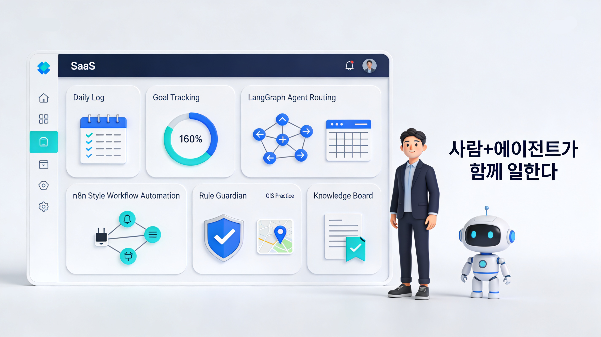

# 지능형 온보딩 및 개발 업무 자동화 플랫폼 (IOAP)



본 프로젝트는 신규 개발자의 온보딩 과정을 자동화하고, 프로젝트의 표준(Rules)이 실시간으로 적용되는 지능형 업무 환경을 구축하는 플랫폼입니다. 기존 가이드 시스템을 넘어 **LangGraph 에이전트**와 **n8n 스타일의 워크플로우**를 통해 능동적인 업무 보조를 지향합니다.

---

## 핵심 가치 (Core Vision)
- **스스로 해답에 도달**: AI 에이전트가 팀의 프로젝트 룰(`rules/`)을 학습하여 실시간으로 가이드합니다.
- **업무 자동화**: 반복적인 엑셀 관리와 온보딩 체크리스트를 워크플로우 엔진이 대신 처리합니다.
- **현무 적합성**: 실무 Java 환경과 최신 AI(Python LangGraph) 생태계를 하이브리드로 결합하여 실질적인 개발 경험을 제공합니다.

## 왜 시작했나?
개발자 수가 늘어도 생산성이 정비례로 오르지 않는 온보딩 병목과 협업 비용을 줄이기 위해 시작했습니다. AI로 구현 속도가 급격히 빨라진 시대에, 룰 준수와 지식 전달을 자동화해 의사결정과 학습 효율을 끌어올리는 것이 목표입니다.

---

## 기술 스택 (Updated)
### Hybrid Backend
- **Main Server (Java)**: Spring Boot 4.0.1, Java 17, JPA, H2 (dev 기본)
- **AI Agent (Python)**: LangGraph, FastAPI, MCP(Model Context Protocol)
- **Database**: PostgreSQL (agent 기본 설정), Redis (agent cache 설정)

### Modern Frontend
- **Framework**: React 19, Vite 6
- **Styling**: Tailwind CSS 4
- **Libraries**: Lucide React, OpenLayers (GIS 실습), React Router, fetch-event-source, clsx, tailwind-merge

---

## 프로젝트 구조 및 문서화
프로젝트의 히스토리와 설계 자산은 아래 폴더에서 관리됩니다.

- **[`/docs/background`](./docs/background)**: 신입 개발자의 고민과 기획의 시작점
- **[`/docs/prd`](./docs/prd)**: 제품 요구사항 정의서(PRD) 및 핵심 시나리오
- **[`/docs/design`](./docs/design)**:
    - [기술 아키텍처 제안서](./docs/design/기술_아키텍처_제안서.md)
    - [데이터베이스 모델링](./docs/design/01_데이터베이스_모델링.md)
    - [API 및 인터페이스 설계](./docs/design/02_API_인터페이스_설계.md)
    - [LangGraph 노드 상세 설계](./docs/design/03_LangGraph_노드_설계.md)
    - [MVP 개발 계획 (2주 집중)](./docs/design/05_상세_구현_일정.md)

---

## 실행 방법
### 1. 사전 준비 (RAG 기능 활성화)
이 프로젝트는 로컬 **Ollama**를 사용하여 프로젝트 규칙을 임베딩하고 검색합니다. 실행 전 아래 과정을 반드시 수행해주세요.

1. **Ollama 설치**: [Ollama 공식 홈페이지](https://ollama.com/)에서 설치
2. **임베딩 모델 다운로드**:
    ```bash
    ollama pull nomic-embed-text
    ```
    (메모리 기반 RAG 검색을 위해 필수입니다)

### 2. 통합 실행
루트 폴더에서 아래 명령어를 실행하면 백엔드(Java), AI 에이전트(Python MCP), 프론트엔드(React)가 동시에 준비됩니다.
```bash
./run.sh
```

### 3. AI 에이전트 설정 (`agent/.env`)
AI 에이전트의 동작 모드를 변경하려면 `agent/.env` 파일을 수정합니다.
```ini
# Local Mode (Ollama - 무료, 보안 강점)
LLM_MODE=local
LLM_PROVIDER=ollama

# API Mode (OpenAI - 높은 성능)
# LLM_MODE=api
# LLM_PROVIDER=openai
# OPENAI_API_KEY=sk-...
```

---

## 마일스톤 (MVP)
1. **1주차**: Java 베이스 환경 구축 및 랭그래프 기반 RAG 에이전트 연동.
2. **2주차**: Java 코드 실습 화면 및 AI 실시간 피드백 검증 완료.
