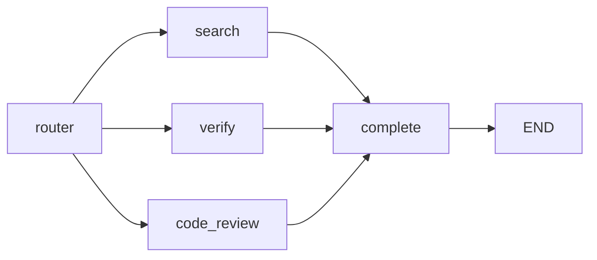
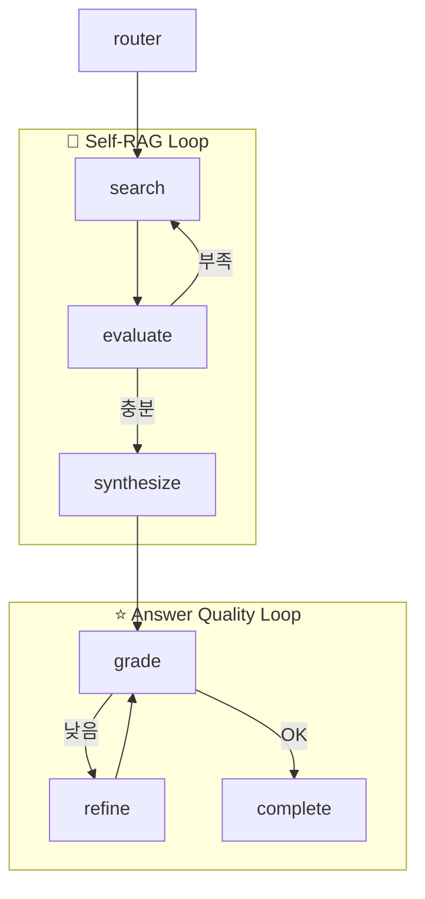

# 🤖 Onboarding Agent Service

LangGraph 기반 지능형 에이전트 서비스 - 개발자 온보딩 플랫폼의 AI 두뇌

## 🚀 Quick Start

### 1. Poetry 설치 (없는 경우)
```bash
curl -sSL https://install.python-poetry.org | python3 -
```

### 2. 의존성 설치
```bash
cd agent
poetry install
```

### 3. 환경 변수 설정
```bash
cp .env.example .env
# .env 파일에 API 키 입력
```

### 4. 서버 실행
```bash
poetry run uvicorn src.main:app --reload --port 8000
```

### 5. API 문서 확인
http://localhost:8000/docs

---

## 📁 프로젝트 구조

```
agent/
├── pyproject.toml      # Poetry 설정
├── .env.example        # 환경 변수 템플릿
├── README.md
└── src/
    ├── main.py         # FastAPI 앱 엔트리포인트
    ├── config.py       # 설정 관리
    ├── llm/            # LLM 클라이언트
    │   ├── __init__.py
    │   └── client.py   # OpenAI/Anthropic/Ollama 클라이언트
    ├── agent/          # LangGraph 에이전트
    │   ├── __init__.py
    │   ├── state.py    # AgentState 정의
    │   ├── nodes.py    # 노드 구현 (router, search, verify, code_review)
    │   └── graph.py    # 그래프 빌더
    └── api/            # FastAPI 라우터
        ├── __init__.py
        ├── routes.py   # API 엔드포인트
        └── schemas.py  # Pydantic 스키마
```

---

## 🔌 API Endpoints

| Method | Endpoint | 설명 |
|:---|:---|:---|
| GET | `/api/v1/health` | 헬스체크 |
| POST | `/api/v1/chat` | AI 채팅 (자동 라우팅) |
| POST | `/api/v1/code-review` | 코드 리뷰 |
| POST | `/api/v1/agent/task` | 자율 에이전트 태스크 |

### 예시: 채팅
```bash
curl -X POST http://localhost:8000/api/v1/chat \
  -H "Content-Type: application/json" \
  -d '{"message": "API 규칙 알려줘"}'
```

### 예시: 코드 리뷰
```bash
curl -X POST http://localhost:8000/api/v1/code-review \
  -H "Content-Type: application/json" \
  -d '{"code": "@RestController\npublic class UserController {}", "language": "java"}'
```

---

## ⚙️ LLM 모드 전환

### API 모드 (기본값 - 초기 개발용)
```env
LLM_MODE=api
LLM_PROVIDER=openai  # 또는 anthropic
OPENAI_API_KEY=sk-...
```

### 로컬 모드 (Ollama - 안정화 후)
```env
LLM_MODE=local
OLLAMA_MODEL=llama3
```

---

## 🧪 테스트
```bash
poetry run pytest
```

---

## 🎛️ LangGraph 그래프 구조 개선

### 개선 전 vs 개선 후

#### 개선 전 (단방향)


#### 개선 후 (동적 패턴)


---

### 활성화 가능한 패턴

| 패턴 | 설정 키 | 설명 |
|------|---------|------|
| 🔄 **Self-RAG** | `enable_self_rag` | RAG 결과 평가 → 부족하면 재검색 |
| ⚡ **병렬 검색** | `enable_parallel_search` | RAG + 파일검색 동시 실행 |
| ⭐ **답변 품질 평가** | `enable_answer_grading` | 답변 품질 평가 → 낮으면 개선 |
| 👤 **사용자 확인** | `enable_human_approval` | 중요 결정에서 승인 요청 |
| 📋 **스텝 로깅** | `enable_step_logging` | 각 노드 실행 로그 출력 |

---

### 관리자 API

```bash
# 현재 설정 조회
curl http://localhost:8000/api/admin/graph-settings

# 설정 업데이트
curl -X PUT http://localhost:8000/api/admin/graph-settings \
  -H "Content-Type: application/json" \
  -d '{"enable_self_rag": false}'

# 그래프 시각화 정보
curl http://localhost:8000/api/admin/graph-visualization
```

### 관리자 페이지
```
http://localhost:5173/admin
```

---

### 관련 파일

| 파일 | 설명 |
|------|------|
| `src/graph_settings.py` | 그래프 패턴 설정 관리 모듈 |
| `src/agent/enhanced_nodes.py` | Self-RAG, 병렬검색, Answer Grading 노드 |
| `src/api/admin_routes.py` | 관리자 설정 API |
| `src/agent/graph.py` | 동적 그래프 빌더 |
| `src/agent/state.py` | Self-RAG, 병렬검색, Grading 상태 필드 |

---

## 📝 라이선스
MIT License

