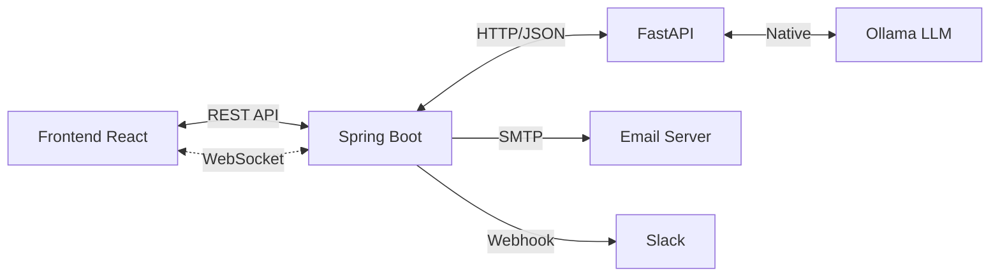

# [상세 설계] API 및 인터페이스 설계 v2.0

## 1. 서비스 간 통신 구조



| 경로 | 프로토콜 | 용도 |
|:---|:---|:---|
| Frontend ↔ Spring | REST (HTTP/JSON) | CRUD 작업 |
| Frontend ↔ Spring | **WebSocket** | AI 응답 스트리밍 |
| Spring ↔ FastAPI | HTTP/JSON | 에이전트 호출 |
| FastAPI ↔ Ollama | **Native Python** | LLM 추론 (API 미사용) |
| Spring → External | SMTP, Webhook | 알림 발송 |

---

## 2. REST API 명세 (Spring Boot)

### 2.1 인증 및 회원 관리

| Method | Endpoint | 권한 | 설명 |
|:---|:---|:---|:---|
| POST | `/api/v1/auth/login` | 전체 | JWT 로그인 |
| POST | `/api/v1/auth/refresh` | 전체 | 토큰 갱신 |
| POST | `/api/v1/auth/register` | MANAGER | 신규 회원 등록 |
| GET | `/api/v1/users` | MANAGER | 회원 목록 조회 |
| GET | `/api/v1/users/{id}` | 전체 | 회원 상세 조회 |
| PUT | `/api/v1/users/{id}` | MANAGER/본인 | 회원 정보 수정 |
| PATCH | `/api/v1/users/{id}/role` | MANAGER | 역할 변경 |
| PATCH | `/api/v1/users/{id}/mentor` | MANAGER | 멘토 지정 |
| DELETE | `/api/v1/users/{id}` | MANAGER | 회원 비활성화 |

**역할별 권한:**
| 권한 | MANAGER | USER |
|:---|:---|:---|
| 회원 등록/관리 | ✅ | ❌ |
| 워크플로우 생성 | ✅ | ❌ |
| 전체 대시보드 조회 | ✅ | ❌ |
| 본인 업무 기록 | ✅ | ✅ |
| AI 에이전트 사용 | ✅ | ✅ |

### 2.2 일일 업무 관리

| Method | Endpoint | 설명 |
|:---|:---|:---|
| GET | `/api/v1/work` | 업무 리스트 조회 (date 파라미터) |
| POST | `/api/v1/work` | 새 업무 추가 |
| PATCH | `/api/v1/work/{id}` | 상태 변경 |
| POST | `/api/v1/work/{id}/feedback` | AI 회고 피드백 요청 |

### 2.3 자율 에이전트 태스크 (신규)

| Method | Endpoint | 설명 |
|:---|:---|:---|
| POST | `/api/v1/agent/task` | 에이전트 태스크 시작 |
| GET | `/api/v1/agent/task/{id}` | 태스크 상태 조회 |
| DELETE | `/api/v1/agent/task/{id}` | 태스크 중단 |
| GET | `/api/v1/agent/task/{id}/steps` | 실행 단계 히스토리 |

**Request 예시 (태스크 시작):**
```json
{
  "description": "rules.md 기반으로 UserController 생성해줘",
  "maxSteps": 10,
  "enableParallel": false
}
```

### 2.4 워크플로우/스케줄러 (신규)

| Method | Endpoint | 설명 |
|:---|:---|:---|
| GET | `/api/v1/workflow` | 워크플로우 목록 |
| POST | `/api/v1/workflow` | 워크플로우 생성 |
| PUT | `/api/v1/workflow/{id}` | 워크플로우 수정 |
| DELETE | `/api/v1/workflow/{id}` | 워크플로우 삭제 |
| POST | `/api/v1/workflow/{id}/trigger` | 수동 실행 |

**Request 예시 (워크플로우 생성):**
```json
{
  "name": "일일 회고 리마인더",
  "triggerType": "SCHEDULE",
  "cronExpression": "0 0 18 * * ?",
  "actionType": "EMAIL",
  "actionConfig": {
    "recipients": ["team@company.com"],
    "subject": "오늘 업무 기록 리마인더"
  }
}
```

### 2.5 알림

| Method | Endpoint | 설명 |
|:---|:---|:---|
| GET | `/api/v1/notifications` | 알림 목록 |
| PATCH | `/api/v1/notifications/{id}/read` | 읽음 처리 |

### 2.6 GIS 실습 (P6 보완)

| Method | Endpoint | 설명 |
|:---|:---|:---|
| GET | `/api/v1/gis/samples` | 샘플 데이터 목록 조회 |
| GET | `/api/v1/gis/samples/{id}` | 샘플 데이터 상세(GeoJSON) |
| POST | `/api/v1/gis/samples` | 샘플 데이터 등록 (관리자) |

### 2.7 지식 공유 게시판 (P7 보완)

| Method | Endpoint | 설명 |
|:---|:---|:---|
| GET | `/api/v1/knowledge` | 게시글 목록 조회 |
| GET | `/api/v1/knowledge/{id}` | 게시글 상세 조회 |
| POST | `/api/v1/knowledge` | 게시글 생성 (관리자) |
| PUT | `/api/v1/knowledge/{id}` | 게시글 수정 (관리자) |
| DELETE | `/api/v1/knowledge/{id}` | 게시글 삭제 (관리자) |

---

## 3. WebSocket 인터페이스 (신규)

### 3.1 연결 엔드포인트

```
WS /ws/ai-stream?token={JWT}
```

### 3.2 메시지 포맷

**Client → Server (요청):**
```json
{
  "type": "CHAT",
  "taskId": "task-123",
  "message": "API 만드는 규칙 알려줘"
}
```

**Server → Client (스트리밍 응답):**
```json
{
  "type": "STREAM",
  "taskId": "task-123",
  "token": "Spring",
  "isComplete": false
}
```

**Server → Client (완료):**
```json
{
  "type": "COMPLETE",
  "taskId": "task-123",
  "fullResponse": "Spring Boot에서는...",
  "metadata": {
    "tokensUsed": 150,
    "duration": 2.3
  }
}
```

### 3.3 Spring WebSocket 핸들러

```java
@Component
public class AiStreamHandler extends TextWebSocketHandler {
    
    @Autowired
    private AgentService agentService;
    
    @Override
    protected void handleTextMessage(WebSocketSession session, TextMessage message) {
        // 1. 메시지 파싱
        // 2. FastAPI 에이전트 호출
        // 3. 스트리밍 응답을 세션으로 전달
    }
}
```

---

## 4. FastAPI ↔ Spring 인터페이스

### 4.1 에이전트 호출

**POST** `http://localhost:8000/agent/invoke`

```json
{
  "threadId": "user-123-session-1",
  "message": "UserController 생성해줘",
  "stream": true
}
```

### 4.2 자율 에이전트 시작

**POST** `http://localhost:8000/agent/autonomous`

```json
{
  "taskId": "task-456",
  "description": "프로젝트 구조 분석 및 문서화",
  "maxSteps": 10
}
```

---

## 5. Ollama 네이티브 연동 (FastAPI 내부)

```python
import ollama

# 동기 호출
response = ollama.chat(
    model="llama3",
    messages=[{"role": "user", "content": prompt}]
)

# 스트리밍 호출
for chunk in ollama.chat(
    model="llama3",
    messages=[{"role": "user", "content": prompt}],
    stream=True
):
    yield chunk["message"]["content"]
```

---

## 6. 데이터 교환 규칙

| 항목 | 규칙 |
|:---|:---|
| 인코딩 | UTF-8 |
| 날짜 형식 | ISO-8601 (`YYYY-MM-DDTHH:mm:ssZ`) |
| 에러 응답 | `{ "error": { "code": "E001", "message": "..." } }` |
| 페이지네이션 | `?page=0&size=20&sort=createdAt,desc` |
