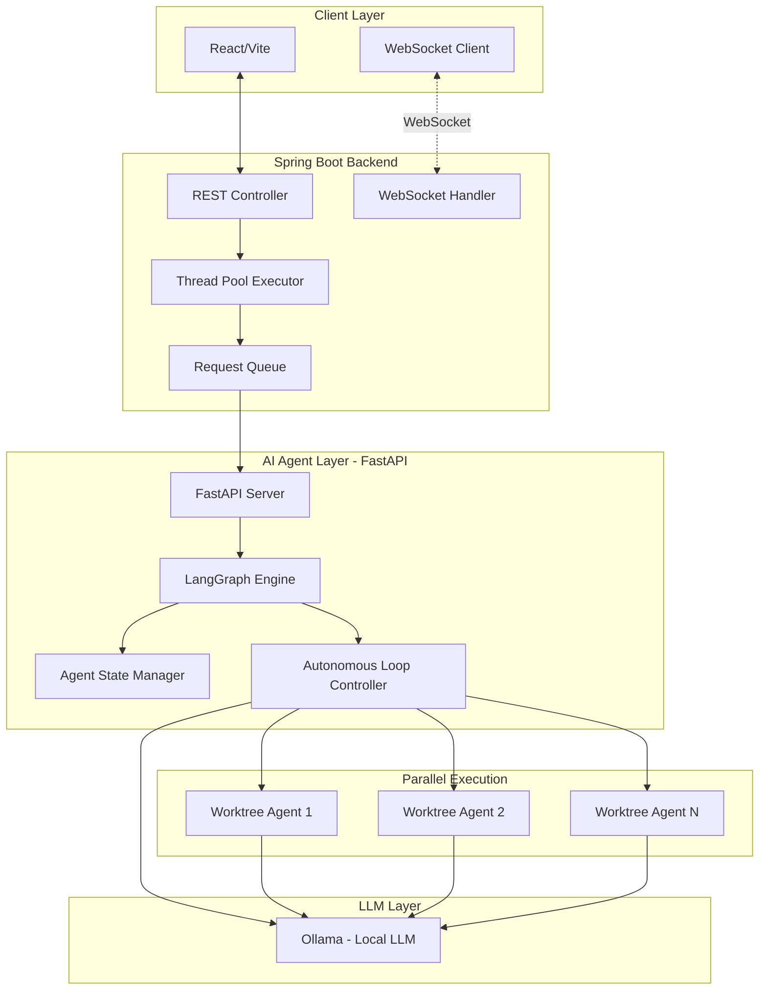

# [기술 제안] Hybrid AI Onboarding Architecture v2.0

## 1. 개요 (Overview)
본 문서는 신무 Java 환경과 최신 AI 생태계(LangGraph + Ollama)를 효율적으로 통합하기 위한 기술 아키텍처 제안서입니다. **v2.0**에서는 로컬 LLM, 실시간 스트리밍, 병렬 에이전트 구조를 반영합니다.

---

## 2. 핵심 기술 스택 (Updated)

| 레이어 | 기술 | 역할 |
|:---|:---|:---|
| **Frontend** | React 18 + Vite 5 | 사용자 인터페이스, WebSocket 클라이언트 |
| **Main Backend** | Spring Boot 3.2 + Java 17 | 비즈니스 로직, Thread Pool, Request Queue, WebSocket 서버 |
| **AI Agent Layer** | FastAPI + LangGraph | 지능형 라우팅, 자율 에이전트 루프 |
| **LLM Engine** | **API 모드 (초기)**: OpenAI/Anthropic API | 안정적인 초기 개발 및 검증 |
| | **로컬 모드 (고도화)**: Ollama (맥북 사양 최적화) | 비용 절감, 오프라인 지원 |
| **병렬 실행** | Git Worktree | 다중 에이전트 인스턴스 병렬 실행 |
| **Database** | PostgreSQL + Redis | 메인 데이터 + 캐싱/세션/큐 |

> [!TIP] LLM 모드 전환 전략
> - **Phase 1 (MVP)**: OpenAI API로 빠르게 검증
> - **Phase 2 (안정화)**: Ollama + 맥북 최적화 모델 (예: Llama3-8B, Phi-3)
> - 환경 변수 `LLM_MODE=api|local`로 런타임 스위칭 가능하게 설계

---

## 3. 시스템 아키텍처 (Diagram)



---

## 4. 핵심 컴포넌트 상세

### 4.1 Spring Boot: Thread Pool & Request Queue

> [!TIP] 학습 포인트
> 실무에서 자주 마주치는 동시성 처리와 비동기 요청 관리를 직접 구현해봅니다.

```java
// ThreadPoolConfig.java 예시
@Configuration
public class ThreadPoolConfig {
    @Bean
    public ThreadPoolTaskExecutor aiTaskExecutor() {
        ThreadPoolTaskExecutor executor = new ThreadPoolTaskExecutor();
        executor.setCorePoolSize(5);
        executor.setMaxPoolSize(10);
        executor.setQueueCapacity(100);
        executor.setThreadNamePrefix("AI-Agent-");
        executor.setRejectedExecutionHandler(new CallerRunsPolicy());
        return executor;
    }
}
```

- **Thread Pool**: AI 요청을 병렬로 처리하여 응답 속도 향상
- **Request Queue**: 폭주하는 요청을 버퍼링하여 시스템 안정성 확보
- **Rejected Handler**: 큐가 가득 찼을 때의 Fallback 전략 학습

### 4.2 WebSocket: 실시간 AI 응답 스트리밍

```java
// WebSocketConfig.java 예시
@Configuration
@EnableWebSocket
public class WebSocketConfig implements WebSocketConfigurer {
    @Override
    public void registerWebSocketHandlers(WebSocketHandlerRegistry registry) {
        registry.addHandler(aiStreamHandler(), "/ws/ai-stream")
                .setAllowedOrigins("*");
    }
}
```

- **스트리밍 응답**: Ollama의 토큰 단위 출력을 실시간으로 클라이언트에 전달
- **연결 관리**: 세션 기반 대화 컨텍스트 유지

### 4.3 FastAPI + LangGraph: 자율 에이전트 루프

```python
# agent_loop.py 예시
from langgraph.graph import StateGraph
import ollama

class AutonomousAgent:
    def __init__(self):
        self.graph = self._build_graph()
        self.ollama = ollama.Client()
    
    def _build_graph(self) -> StateGraph:
        # LangGraph 노드 구성
        graph = StateGraph(AgentState)
        graph.add_node("think", self.think_node)
        graph.add_node("act", self.act_node)
        graph.add_node("observe", self.observe_node)
        graph.add_conditional_edges("observe", self.should_continue)
        return graph.compile()
    
    async def run_loop(self, initial_task: str):
        """자율적으로 계속 실행하는 에이전트 루프"""
        state = {"task": initial_task, "steps": []}
        while not state.get("done"):
            state = await self.graph.ainvoke(state)
        return state
```

- **Think-Act-Observe 루프**: 에이전트가 스스로 계획하고 실행하고 결과를 관찰
- **Ollama 네이티브**: 외부 API 없이 로컬에서 추론

### 4.4 Git Worktree: 병렬 에이전트 실행

```bash
# 병렬 에이전트 실행 스크립트 예시
#!/bin/bash
PROJECT_ROOT=$(pwd)

# 각 에이전트를 별도의 worktree에서 실행
git worktree add ../agent-worker-1 main
git worktree add ../agent-worker-2 main

# 병렬 실행
cd ../agent-worker-1 && python agent.py --task="code-review" &
cd ../agent-worker-2 && python agent.py --task="doc-generation" &

wait
```

> [!IMPORTANT] Git Worktree의 장점
> - 동일 저장소에서 여러 브랜치/작업을 동시에 실행 가능
> - 에이전트 간 파일 충돌 없이 독립적인 작업 공간 확보
> - CI/CD 파이프라인에서도 활용 가능

---

## 5. 기술 선택 근거 (Justification)

### 🚩 오버 엔지니어링 방지
1. **Ollama 로컬 실행**: 외부 API 비용과 레이턴시 제거, 보안 강화
2. **Git Worktree**: 복잡한 컨테이너 오케스트레이션 대신 가벼운 병렬화 구현
3. **Spring 내장 기능 활용**: 외부 메시지 큐(Kafka 등) 대신 내장 Thread Pool/Queue로 심플하게 시작

### 🚩 실무 학습 적합성
1. **Thread Pool/Queue**: 면접에서 자주 나오는 동시성 처리 핵심 개념 실습
2. **WebSocket**: 실시간 서비스 개발 경험 확보
3. **LangGraph**: 최신 에이전트 아키텍처 학습

---

## 6. 기대 효과
- **신입 사원 입장**: 실제 Java 환경에서 AI 가이드를 받으며 실습, 동시에 최신 AI 에이전트 구조 학습
- **개발자 입장**: 유지보수가 용이한 구조에서 로컬 LLM 기반 지능형 시스템 구축 가능
- **시스템 관점**: 외부 의존성 최소화로 안정적이고 비용 효율적인 운영
